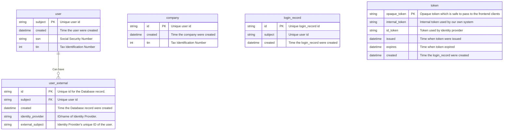

```mermaid
erDiagram


    user {
        string subject PK "Unique user id"
        datetime created "Time the user were created"
        string ssn "Social Security Number"
        int tin "Tax Identification Number"
    }

    user_external {
        string id PK "Unique id for the Database record."
        string subject FK "Unique user id"
        datetime created "Time the Database record were created"
        string identity_provider "ID/name of Identity Provider."
        string external_subject "Identity Provider's unique ID of the user."
    }

    user ||--o{ user_external : "Can have"

    company {
        string id PK "Unique user id"
        datetime created "Time the company were created"
        int tin "Tax Identification Number"
    }

    login_record {
        string id PK "Unique login_record id"
        string subject "Unique user id"
        datetime created "Time the login_record were created"
    }

    token {
        string opaque_token PK "Opaque token which is safe to pass to the frontend clients"
        string internal_token "Internal token used by our own system"
        string id_token "Token used by identity provider"
        datetime issued "Time when token were issued"
        datetime expires "Time when token expired"
        datetime created "Time the login_record were created"
    }
```
